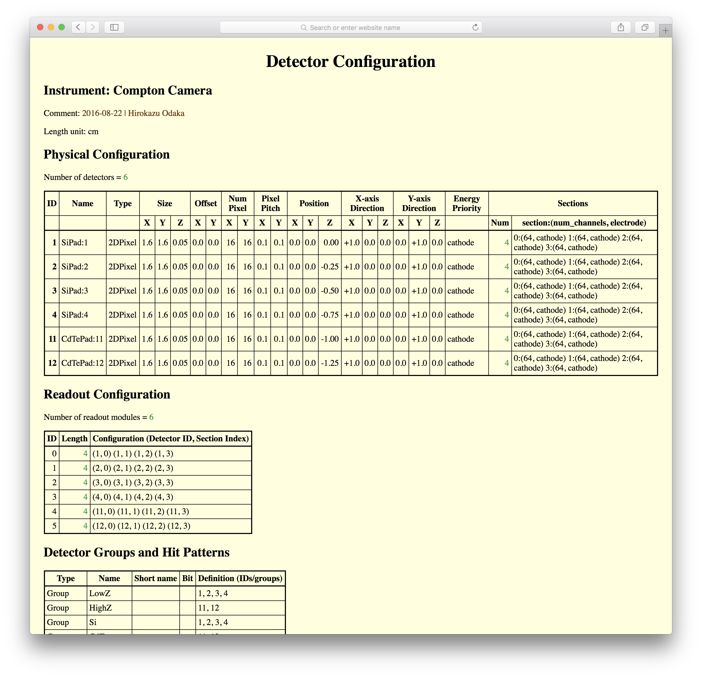

Data Format | Compton Soft
================================================================

[Home](../README.md)

 1. Event Data
----------------------------------------------------------------

### Hit Tree

Hit Tree is a default output format of ComptonSoft. This TTree object
contains information on hits detected in a detector system. The name of
the object is *hittree*. There are 46 branches:

#### [0] eventid (signed 8-byte integer)
Event ID to which the hit belongs.

#### [1] ihit (signed 2-byte integer)
Index of the hits in this event.

#### [2] num_hits (signed 4-byte integer)
Number of hits in this event.

#### [3] ti (signed 8-byte integer)
Time Indicator: this is a measured time by a detector readout system
clock.

#### [4] instrument (signed 2-byte integer)
Instument ID.

#### [5] detector (signed 2-byte integer)
Detector ID.

#### [6] det_section (signed 2-byte integer)
Section index of detector-based channel ID.

#### [7] readout_module (signed 2-byte integer)
Readout module ID.

#### [8] section (signed 2-byte integer)
Section index of readout-based channel ID.

#### [9] channel (signed 2-byte integer)
Channel index (common regardless of detetor-base of readout-base).

#### [10] pixelx (signed 2-byte integer)
Pixel index in the x-axis.

#### [11] pixely (signed 2-byte integer)
Pixel index in the y-axis.

#### [12] rawpha (signed 4-byte integer)
Measured PHA value (raw ADC value).

#### [13] pha (4-byte floating point)
PHA (pulse height amplitude) value.
This branch is used for a corrected value (e.g. pedestal,
common-mode noise corrections are applied).

#### [14] epi (4-byte floating point, keV)
Energy value obtained from the PHA value after gain correction.
(EPI stands for Energy pulse height invariant).

#### [15] flag_data (unsigned 8-byte integer)
Flag data assigned by the detector readout system.

#### [16] flags (unsigned 8-byte integer)
Flags used in Compton Soft.

#### [17] real_time (8-byte floating point)
Raw simulation output of time.

#### [18] time_trig (8-byte floating point)
Time of the trigger.

#### [19] time_group (signed 2-byte integer)
Time group ID. This ID distinguishs different readout groups at temporally
separate readout (different trigger) but belong to the same event ID.
This can happen if a radioactive primary makes decays distributed in a
period longer than a detector readout timescale.

#### [20] real_posx (4-byte floating point)
Raw simulation output of position x.

#### [21] real_posy (4-byte floating point)
Raw simulation output of position y.

#### [22] real_posz (4-byte floating point)
Raw simulation output of position z.

#### [23] edep (4-byte floating point)
Raw simulation output of energy deposit.
If a quenching factor is not unity, this factor is multiplied.

#### [24] echarge (4-byte floating point)
Energy deposit multiplied by charge collection efficiency.

#### [25] process (unsigned 4-byte integer)
Process flags.

#### [26] energy (4-byte floating point)
Reconstructed energy.

#### [27] posx (4-byte floating point)
Reconstructed position x.

#### [28] posy (4-byte floating point)
Reconstructed position y.

#### [29] posz (4-byte floating point)
Reconstructed position z.

#### [30] local_posx (4-byte floating point)
Reconstructed position x in detector-local coordicates.

#### [31] local_posy (4-byte floating point)
Reconstructed position y in detector-local coordicates.

#### [32] local_posz (4-byte floating point)
Reconstructed position z in detector-local coordicates.

#### [33] time (8-byte floating point)
Reconstructed time.

#### [34] grade (signed 4-byte integer)
Grade of this event.

#### [35] ini_energy (4-byte floating point)
Energy of the primary particle of this event.

#### [36] ini_dirx (4-byte floating point)
Direction x of the primary particle of this event.

#### [37] ini_diry (4-byte floating point)
Direction y of the primary particle of this event.

#### [38] ini_dirz (4-byte floating point)
Direction z of the primary particle of this event.

#### [39] ini_time (8-byte floating point)
Time of the primary particle of this event.

#### [40] ini_posx (4-byte floating point)
Position x of the primary particle of this event.

#### [41] ini_posy (4-byte floating point)
Position y of the primary particle of this event.

#### [42] ini_posz (4-byte floating point)
Position z of the primary particle of this event.

#### [43] ini_polarx (4-byte floating point)
Polarization vector x of the primary particle of this event.

#### [44] ini_polary (4-byte floating point)
Polarization vector y of the primary particle of this event.

#### [45] ini_polarz (4-byte floating point)
Polarization vector z of the primary particle of this event.

#### [46] weight (4-byte floating point)
Statistical weight of this event.

### Event Tree

Event Tree has almost the same information as the Hit Tree. But this tree
has different format with a variable-length array.
The object name is *eventtree*.

### Compton Event Tree

The object name is *cetree*.

 2. Database for Simulations and Analysis
----------------------------------------------------------------

All database formats are written in XML and support XSLT stylesheet.
You can view the contents of the database by your web browser.
You can see concrete samples in [examples/simulations](https://github.com/odakahirokazu/ComptonSoft/tree/master/examples/simulations) directory.

### Detector Configuration

This database file describes detector configuration which includes
detector ID, name, type, geometry, pixel segmentation, position of the
detectors. This file is mandatory for simulations. This database also
desribes readout orders in serialized data readout if this information is
needed. The database can also define detector groups and hit patterns.

### Channel Map

This database file describes relation between geometrical pixels and
electrical readout channels. This database is optional, and is not
necessary if you do not want to simulate readout configuration of your
real detector.

### Detector Parameters

This database file contains information on detector parameters. This file
is mandatory for simulations. Important required information is mapping
of physical volumes in Monte-Carlo simulation to real detectors. This
database can also describe detector parameters used for simulations and
analysis such as noise levels, diffusion properties, and threshold values.

### Channel Properties

This database file contains information on properties associated with
readout channels. You can specify detailed characteristics of each
channel. This file is optional.

****************************************************************
